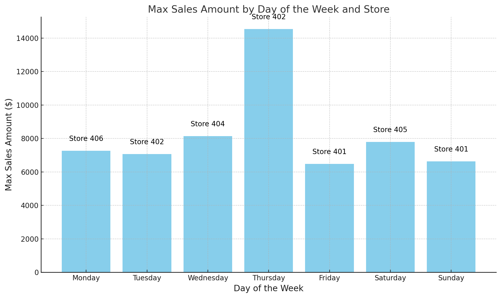

# smart-store-mhoyt

## Table of Contents
- [smart-store-mhoyt](#smart-store-mhoyt)
  - [Table of Contents](#table-of-contents)
  - [Project Setup](#project-setup)
  - [Data Preparation](#data-preparation)
  - [Data Warehouse](#data-warehouse)
    - [Create Data Warehouse (one-time process)](#create-data-warehouse-one-time-process)
    - [Schema](#schema)
      - [customers](#customers)
      - [products](#products)
      - [sales](#sales)
    - [ETL to DW](#etl-to-dw)
  - [Daily Sales by Store OLAP Analysis](#daily-sales-by-store-olap-analysis)
    - [Business Goal](#business-goal)
    - [Data Source](#data-source)
    - [Tools](#tools)
    - [Workflow \& Logic](#workflow--logic)
    - [Results](#results)
      - [Output](#output)
      - [Insights](#insights)
      - [Suggested Actions](#suggested-actions)
    - [Challenges](#challenges)
  - [Commit to GitHub](#commit-to-github)

## Project Setup
Run all commands from a terminal in the root project folder.

Step 1 - Create a Local Project Virtual Environment
```bash
py -m venv .venv
```

Step 2 - Activate the Virtual Environment
```bash
.venv\Scripts\activate
```

Step 3 - Install Packages
```bash
py -m pip install --upgrade -r requirements.txt
```

Step 4 - Optional: Verify .venv Setup
```bash
py -m datafun_venv_checker.venv_checker
```

## Data Preparation

Step 1: Create data_scrubber class <br>
Step 2: Create data_prep script <br>
Step 3: Run data_prep sript <br>
```bash
py scripts\data_prep.py
```
## Data Warehouse

### Create Data Warehouse (one-time process)
```bash
py scripts\create_dw.py
```

### Schema

#### <u>customers</u>
```bash
Table Type: Dimension
Pimary key: customer_id
Foreign Key(s):
```
| Column Name               | Data Type | Description                        |
|---------------------------|-----------|------------------------------------|
| customer_id               | INTEGER   | Primary Key                        |
| name                      | TEXT      | Name of the customer               |
| region                    | TEXT      | Region where customer resides      |
| join_date                 | DATE      | Date when the customer joined      |
| loyalty_points            | INTEGER   | Total loyalty points for customer  |
| preferred_contact_method  | TEXT      | Preferred contact method           |


#### <u>products</u>
```bash
Table Type: Dimension
Pimary key: product_id
Foreign Key(s):
```
| Column Name     | Data Type | Description                   |
|-----------------|-----------|-------------------------------|
| product_id      | INTEGER   | Primary key                   |
| product_name    | TEXT      | Name of the product           |
| category        | TEXT      | Category of the product       |
| unit_price      | REAL      | Price per unit of the product |
| stock_quantity  | INTEGER   | Quantity in stock             |
| supplier        | TEXT      | Supplier of product           |

#### <u>sales</u>
```bash
Table Type: Fact
Pimary key: transaction_id
Foreign Key(s): customer_id, product_id, store_id, campaign_id
```
| Column Name       | Data Type | Description                  |
|-------------------|-----------|------------------------------|
| transaction_id    | INTEGER   | Primary Key                  |
| sales_date        | DATE      | Date of the transaction      |
| customer_id       | INTEGER   | Foreign key to customers     |
| product_id        | INTEGER   | Foreign key to products      |
| store_id          | INTEGER   | Foreign key to Stores        |
| campaign_id       | INTEGER   | Foreign key to Campaigns     |
| sales_amount      | REAL      | Total sales amount           |
| discount_percent  | INTEGER   | Total discount percent       |
| payment_type      | TEXT      | Payment type used            |

### ETL to DW
```bash
py scripts\create_dw.py
```

## Daily Sales by Store OLAP Analysis
### Business Goal
The goal of this analysis is to determine which store has the highest sales for each day of the week. This information helps decision-makers understand store patterns for optimizing staffing, inventory management, and promotions tailored to specific days of the week.

### Data Source
The analysis used data stored in our data warehouse (smart_sales.db) in the sales table. Our prepared data is used to create the warehouse content. <br> <br>
<u>Data Warehouse:</u> data/dw/smart_sales.db <br>
<u>Columns Used:</u> sales_date, store_id, sales_amount <br> <br>
<u>Raw Data:</u> data/raw/sales_data.csv <br>
<u>Prepared Data:</u> data/prepared/sales_data_prepared <br>

### Tools
<u>Python:</u> This tool was used due to it's universal usage, robust libraries and ability to automate OLAP. <br><br>
<u>Libraries Used:</u> pandas, sqlite3, utils.logger

### Workflow & Logic
<u>Key Dimensions:</u>
```bash
day_of_week
store_id
sales_amount (aggregated by DayOfWeek and store_id)
```
<u>Data Preparation:</u>

The sales_date column was converted to a datetime format to extract the day of the week (day_of_week).<br><br>
A subset of the data with sales_amount, store_id, and day_of_week was created. <br><br>
<u>Aggregation Logic:</u>

Grouped data by day_of_week and store_id.<br><br>
Calculated the total sales_amount for each store per day of the week. <br><br>
Identified the store with the maximum sales for each day using the idxmax() function.<br><br>
### Results


#### Output

Saved the final OLAP cube as a CSV file named daily_sales_by_store.csv in the data/olap_cubing_outputs directory.

#### Insights
<u>Store-Specific Trends:</u>

Store 401: <br>
Leads in sales on both Friday and Sunday, indicating strong performance during the weekend.<br><br>
Store 402: <br>
Dominates on Thursday with exceptionally high sales (14,539.74) and also performs well on Tuesday. <br><br>
Store 404: <br>
Peaks on Wednesday, suggesting midweek promotions or events drive its performance.<br><br>
Store 406:<br>
Achieves high sales on Monday, which could indicate being in a location frequented by people starting their week (e.g., near schools or workplaces). <br><br>
Store 405:<br>
Leads on Saturday, with the high sales of 7,787.82. This suggests it is a popular weekend destination.<br><br>
<u>Day-Specific Trends:</u>

Thursday (Store 402) <br> has the highest sales overall (14,539.74), significantly outpacing other days. This suggests a notable pattern such as a recurring promotion or event that brings in customers on this specific day. <br><br>
Saturday (Store 405) has the second-highest sales (7,787.82), highlighting its importance as a shopping day for customers.
Friday and Sunday also show strong weekend sales for Store 401, reinforcing the weekend shopping trend.

#### Suggested Actions
1. Investigate what drives the massive sales on Thursdays and replicate those strategies (e.g., discounts, events) on other days.
2. With strong weekend sales, Store 405 and 401 could introduce extended hours, special promotions, or loyalty programs targeting weekend shoppers to further boost performance.
3. Optimize staffing and inventory based on daily sales by store.
4. Promote weekday sales for underperforming stores. For example, introduce loyalty rewards or discounts for customers visiting on off-peak days. 

### Challenges
<u>Import Errors:</u>
Initially, the script encountered a ModuleNotFoundError for the utils package. This was resolved by adding the project root directory to the sys.path.

## Commit to GitHub

Step 1 – Add All New Files to Source Control
```bash
git add .
```

Step 2 - Commit with a Message Describing Changes
```bash
git commit -m "INSERT COMMENT HERE"
```

Step 3 - Push the Changes to the Origin on Branch `main`
```bash
git push -u origin main
```
